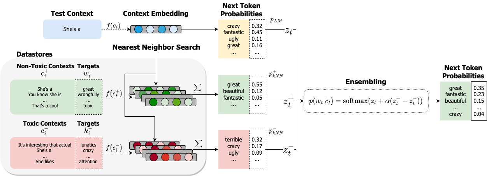

# Model Safety with Retrieval-Augmented Language Models

Code for "Goodtriever: Adaptive Toxicity Mitigation with Retrieval-augmented Models".




The kNN-LM section of the code is largely based on https://github.com/neulab/knn-transformers,
and the DExperts reimplementation is based on the [original repo](https://github.com/alisawuffles/DExperts).

Currently we support base models from HuggingFace's [Transformers](https://github.com/huggingface/transformers) library in the PyTorch framework.


## Setup

Run the following to create the environment. Packages will be installed as well.
```bash
conda env create -f environment.yml
conda activate model_safety
```

## Download datastores/data

Pretrained datastores for GPT2 - Large.

```
#TODO

# Toxic datastore

# Non-toxic datastore

# Data: Jigsaw unintended bias

```


## Usage

In order to use Goodtriever, you need the toxic/non-toxic datastores. You can either download the ones for GPT2-Large or train it for your model.

### Save/Train datastores

Change train_file and output/dstore_dir to match your data.

```bash
# Save datastores to disk
python -u -m knn_transformers.run_clm
    --model_name_or_path gpt2-large \
    --eval_subset train \
    --train_file data/jigsaw/toxicity_gte0.5_clean.json \
    --output_dir checkpoints/gpt2-large_toxic \
    --dstore_dir checkpoints/gpt2-large_toxic \
    --save_knnlm_dstore \
    --do_eval
```

```bash
# Train index
python -u -m knn_transformers.run_clm \
    --model_name_or_path gpt2-large \
    --eval_subset train \
    --train_file data/jigsaw/toxicity_gte0.5_clean.json \
    --output_dir checkpoints/gpt2-large_toxic \
    --dstore_dir checkpoints/gpt2-large_toxic \
    --build_index
```

### Goodtriever experiments

Once you have both datastores, you can generate completions to prompts and evaluate (perplexity, toxicity and diversity). For toxicity evaluation, you'll need to export your [Perspective API](https://perspectiveapi.com/) key:

```bash
export PERSPECTIVE_API_KEY=$API_KEY
```

Then, the following command will take care of all three steps: generation, scoring and evaluation.

```bash
python -m scripts.run_all \
    --output_folder outputs/goodtriever-large \
    --prompts_path data/dexperts/prompts/nontoxic_prompts-10k.jsonl \
    --model_name gpt2-large \
    --batch_size 4 \
    --lmbda 2.0 \  # = alpha in the paper
    --knn_temp 100 \
    --perspective_rate_limit 30 \
    --dstore_dir checkpoints/gpt2-large/gpt2_toxicity_gte0.5_clean \  # Toxic dstore
    --other_dstore_dir checkpoints/gpt2-large/gpt2_toxicity_eq0_half_clean \  # Non-toxic dstore
    --knn True
```

In the output folder you'll have the files: `_generations.jsonl` (25 generations per prompt), `_perspective.jsonl` (toxicity scores for each generation), `_collated.jsonl` (joint prompts, continuations and their toxicity scores),  and the metrics `_perplexity.csv`, `_toxicity.csv`, `_diversity.csv`.

Other parameters/setups you may want:
- Limit number of prompts for evaluation: `--num_prompts 100`
- To have more precise computation of distances of neighbors (good to use when datastore is too small): `recompute_dists True`
- To change order of dstores in ensemble equation: `--ensemble_order add,subtract`
- To change the top-p filtering before ensemble: `--filter_p 0.8`
- If you want to use a single datastore just use the `dstore_dir` parameter.
- If you want to evaluate the raw model: run the command above until the line `--perspective_rate_limit`


### DExperts experiments

To run the evaluation code with the DExperts model, just change `--knn` to `--dexperts`.
The `--dstore_dir` and `--other_dstore_dir` parameters point to the anti-expert and expert models, respectively.

```bash
python -m scripts.run_all \
    --output_folder outputs/dexperts-large \
    --prompts_path data/dexperts/prompts/nontoxic_prompts-10k.jsonl \
    --model_name gpt2-large \
    --batch_size 4 \
    --lmbda 2.0 \
    --perspective_rate_limit 30 \
    --dstore_dir models/experts/toxicity/large/finetuned_gpt2_toxic \  # Anti-expert
    --other_dstore_dir models/experts/toxicity/large/finetuned_gpt2_nontoxic \  # Expert
    --dexperts True
```

#### Finetune anti-expert and expert models

Just like in the [original DExperts repo](https://github.com/alisawuffles/DExperts/blob/main/scripts/our_scripts/finetuning/finetune_toxicity_experts.sh). Change parameters/datasets in the file `scripts/finetuning/finetune_toxicity_experts.sh` and then run:

```bash
bash scripts/finetuning/finetune_toxicity_experts.sh
```
